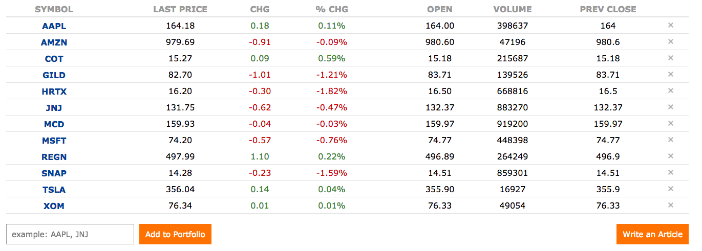
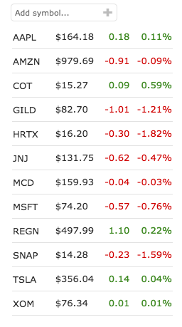
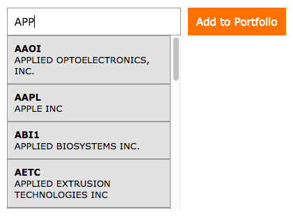
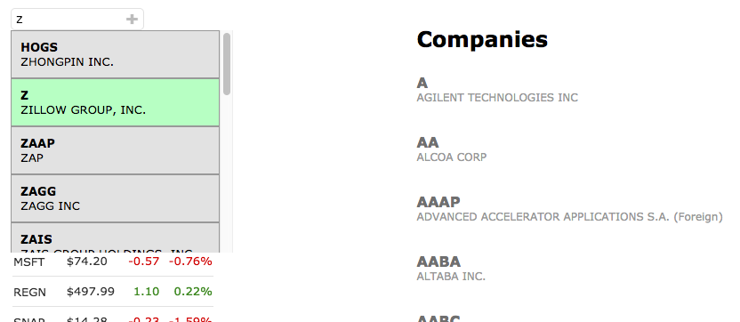

# Ticker

Ticker is a market data and news application designed for investors to track and share information about equities. Based on [Seeking Alpha](https://seekingalpha.com/), Ticker allows users to create portfolios, view live market data and read/write articles on any stock. It was built with a Rails backend that acts solely as an API, a PostgreSQL database, and a React/Redux frontend for single-page speed and functionality.

Check out the site here: [Ticker](http://ticker-site.herokuapp.com/#/login)

## Technologies

- Ruby on Rails
- React.js
- Redux
- PostgreSQL
- jQuery
- jBuilder

### Portfolios

Portfolios allow users to keep track of their holdings. They are visible and editable no matter where you are on the site, appearing in either one of two formats.

There is the primary `portfolio.jsx` component which occupies its own page and shows detailed info:



And the sidebar `portfolio_aside.jsx` component which appears on every other page with truncated info:



Both of these components draw information from the same `stocks` slice of state. Because they require the same information but appear on different pages, fetching the required data could potentially become redundant switching back and forth between them. To avoid these unnecessary fetches, their mounting methods have conditional checks and only fetch when a quote isn't present in state.

### Company Search & Autocomplete

Searching for a stock to add to your portfolio is done through text input that smartly parses as you type and renders matches based on both company `name` and `ticker`:



I made the decision to store a snapshot of all major companies in the database while implementing this autocomplete functionality (as opposed to fetching the data from an outside source) for reliability and speed. Every keystroke queries about 8500 rows in the `companies` table, and the query is limited to 15 hits to ensure instantaneous results and a digestible list length for the user.

### Search Overlap

The omni-searchbar at the top of the page parses companies in the same manner as the add-to-portfolio forms do (by company `name` and `ticker`), while also matching `articles` based on `title`, `ticker_tag`, company `name` based on the article's `ticker_tag`, and author's `username` based on the article's `user_id`.

The landing page for these searches will list companies and articles, and on that same page you can add stocks to your portfolio from the sidebar. Because these search results rely on the same `companies` slice of state, there was a potential conflict. Searching in the sidebar could change the landing page results. To solve this, I created a `search` slice of state that stores a `searchType` value to distinguish which searchbar is being used (updating on each keystroke). Combined with `shouldComponentUpdate` lifecycle methods, one searchbar's results could be frozen while another updates, as seen below:

 (An omni-search of 'A', and the results accompanied by a sidebar-search of 'Z')

### Live Market Data

Market data is never truly free, but piecing together Google's finance API for instant quotes, [Alpha Vantage](https://www.alphavantage.co/documentation/) for intraday time series, and [Quandl](https://www.quandl.com/publishers/sharadar) to populate the `companies` table, Ticker manages to provide mostly accurate and up-to-date equity information.

These APIs are error prone in that they sometimes go down for maintenance or cannot handle a request for a defunct company. To overcome these occasional shortcomings, I made action creators to fill in fake data that simulates realistic activity in case of failure. Checking for failure involved cases where an API would respond with an errorful non-200 status, but also the trickier case in which a successful response was given but with null values. Conditional checks were implemented to deal with both situations, as in the example below for fetching intraday data:

```javascript
export const fetchIntraday = (symbol) => (dispatch) => {
  return APIUtil.requestIntraday(symbol).then(
    (stockData) => {
      (Object.keys(stockData).length === 0 || Object.keys(stockData)[0] === "Error Message") ?
        dispatch(receiveFakeIntraday(symbol)) :
        dispatch(receiveIntraday(stockData))
    },
    () => dispatch(receiveFakeIntraday(symbol)),
  );
};
```

### Future Features

- Ticker will have categories beyond just stocks for which users can write articles about, such as bonds, ETFs, commodities, etc.

- Users will be able to follow other users and have a news feed of new articles.

- Article text will be parsed for recognizable tickers/company names which will automatically be made into hyperlinks pointing to that stock's page. 
